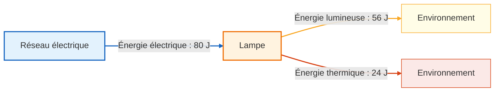

## Principe de conservation de l'énergie
Il s'agit ici de l'un des principes fondamentaux de la physique. **L'énergie ne peut ni être créée ni disparaître**. 

Elle peut uniquement être **transformée** en une énergie différente ou bien **transférée** d'un système vers un autre.

- <u>on dit qu'il y a **transfert d'énergie** si l'énergie passe d'un système à un autre sans pour autant changer de forme.</u>

Par exemple: un radiateur produit de l'énergie thermique. Cette énergie thermique est transférée à l'air environnant, puis elle est à nouveau transférée aux personnes à proximité, ce qui les réchauffe. Tout au long de ce processus, l'énergie n'a pas subi de changement de forme, elle est restée de l'énergie thermique.

- <u>on dit qu'il y a **conversion d'énergie** si l'énergie change de forme après passage dans un système.</u>

Par exemple: une lampe branchée à une prise reçoit de l'énergie électrique et la convertit en énergie lumineuse, remplissant ainsi sa fonction.

## Rendement d'un système

Attention en revanche; certes l'énergie se conserve à 100% mais dans la réalité, un système qui convertit parfaitement une énergie en une autre n'existe pas! Il y a toujours des **pertes**, le plus souvent sous forme **d'énergie thermique**. Pour reprendre l'exemple de la lampe, celle-ci va consommer de l'énergie électrique pour produire de l'énergie lumineuse, mais une partie de l'énergie consommée sera dissipée en énergie thermique à la place, ce qui va faire chauffer la lampe.

$$
\boxed{E_{\text{consommée}} = {E_{\text{utile}}}+{E_{\text{dissipée}}}}
$$

On définit alors le **rendement** d'un système, qui correspond au rapport entre l'énergie que l'on souhaite produire, appelée **énergie utile**, et l'énergie que l'on a **consommée**. Puisque l'énergie utile est forcément inférieure à l'énergie consommée, on trouve un résultat entre 0 et 1, que l'on multiplie le plus souvent par 100 pour avoir un nombre plus parlant. Par ailleurs, **le rendement n'a pas d'unité**, puisqu'on a divisé deux grandeurs qui ont la même.

$$
\boxed{\eta = \frac{E_{\text{utile}}}{E_{\text{consommée}}}}
$$

Si je mesure l'énergie consommée par ma lampe, que je trouve $80J$, puis que je mesure l'énergie lumineuse produite, que je trouve $56J$, alors le rendement de ma lampe est de $\eta = \frac{56}{80}=0.7=70$%

Par ailleurs, $80-56=24J$ ont été dissipés sous forme d'énergie thermique.

## Chaîne énergétique

Afin de représenter les transferts et les conversions d'énergie qui s'opèrent dans un ou plusieurs systèmes successifs, on utilise une chaîne énergétique. Sur celle-ci, on représente les **énergies entrantes et sortantes par des flèches** (on marque le nom de l'énergie en question dessus). Les éléments du système sont quant à eux représentés par des **bulles ou des rectangles**.

Exercice

Voir les chaînes énergétiques de l'onglet centrales électriques

Solution

À compléter

